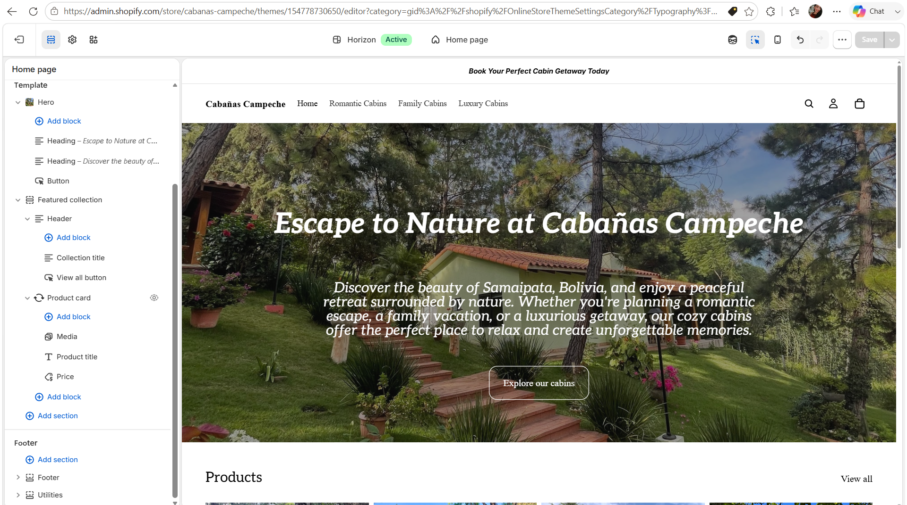
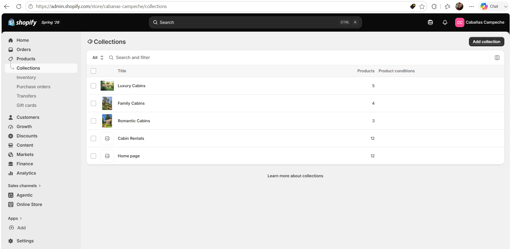
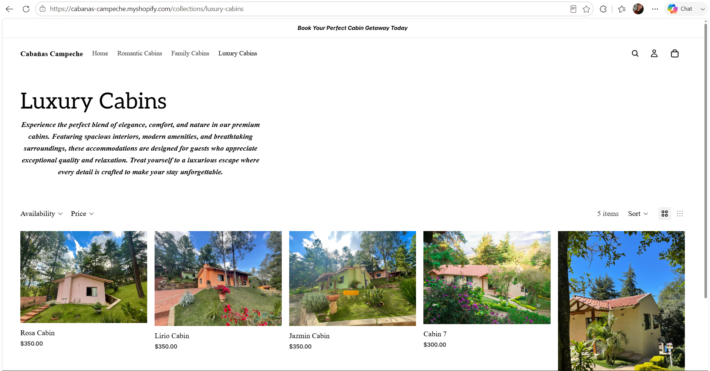
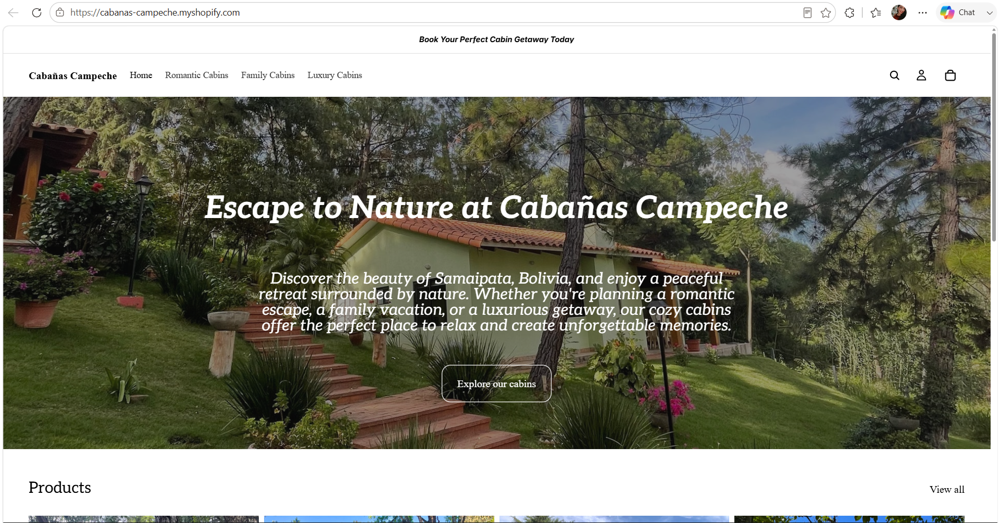

# Introduction

This report presents the organization of the **Cabañas Campeche** Shopify store. The purpose of this assignment was to improve the browsing experience by creating meaningful product collections and a clear navigation menu. Organizing products into collections allows customers to quickly find accommodations that match their travel preferences while creating a more intuitive and enjoyable shopping experience.^[This Shopify store was created for educational purposes as part of the ITP Shopify Store course.]

::: {.callout-note}
## Assignment Objective

The goal of this assignment was to organize the Shopify store into logical collections and improve customer navigation by designing a simple and effective menu structure.
:::

# Store Homepage

Figure @fig-homepage shows the customized homepage of the Cabañas Campeche Shopify store.

{#fig-homepage width=100%}

# Collections and Categories

The store was organized into three collections based on the type of experience customers are looking for.

| Collection | Description | Number of Cabins |
|:-----------|:------------|:----------------:|
| Romantic Cabins | Cozy cabins designed for couples looking for privacy and relaxation. | 3 |
| Family Cabins | Spacious cabins ideal for families and groups. | 4 |
| Luxury Cabins | Premium cabins with upgraded amenities and beautiful surroundings. | 5 |

## Shopify Collections

Figure @fig-collections displays the collections created in the Shopify Admin.

{#fig-collections width=100%}

## Collection Page

Figure @fig-storefront shows the Luxury Cabins collection as displayed on the storefront.

{#fig-storefront width=100%}

# Navigation Menu

The main navigation menu was redesigned to provide customers with quick access to the most important sections of the store. Instead of displaying all products in a single catalog, the menu directs visitors to cabin collections based on the type of vacation they are planning.

The navigation menu includes:

- Home
- Romantic Cabins
- Family Cabins
- Luxury Cabins
- Contact

Figure @fig-navigation shows the navigation menu displayed on the storefront.

{#fig-navigation width=100%}

# Merchandising Logic

The cabins were organized into three collections based on the type of experience customers are seeking. Romantic Cabins were designed for couples looking for a peaceful and private getaway, Family Cabins were grouped for guests traveling with children or larger groups, and Luxury Cabins highlight premium accommodations with upgraded amenities and scenic surroundings. This merchandising strategy makes it easier for customers to compare options while improving product discovery and encouraging more confident booking decisions.

# Customer Experience

The navigation structure was designed to make the website simple, intuitive, and easy to browse. Visitors can immediately identify the main categories of accommodations without scrolling through every cabin individually. By organizing the menu around customer needs, the website reduces the time required to locate information and creates a more enjoyable booking experience.

# CPP Farm Store Application Reflection

The CPP Farm Store could organize its online catalog into collections such as Fresh Produce, Dairy Products, Pantry Items, Seasonal Products, and Gift Boxes. Organizing products into meaningful categories would help customers quickly locate items while also promoting seasonal offerings and specialty products. A well-designed navigation menu would improve the online shopping experience and encourage customers to explore additional products.

::: {.callout-tip}
## Key Takeaway

Well-organized collections and a clear navigation menu improve usability, reduce customer effort, and create a more professional online shopping experience.
:::

# Appendix

## GitHub Repository

<https://github.com/yourusername/ITP-Assignment4>

## GitHub Pages

<https://yourusername.github.io/ITP-Assignment4/>